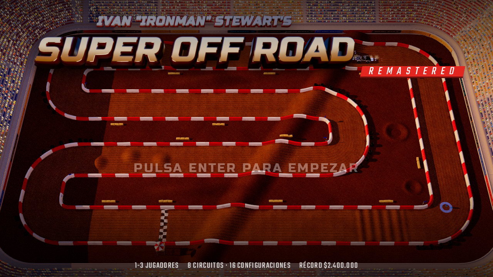
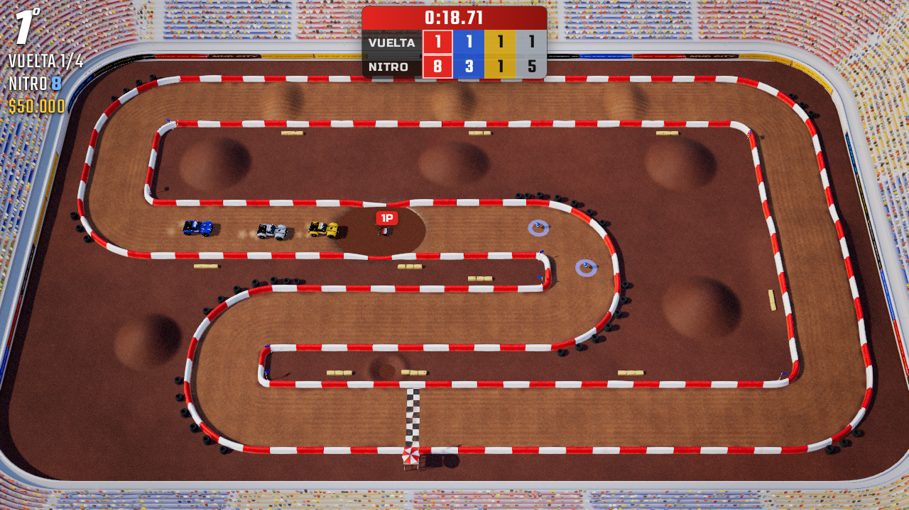
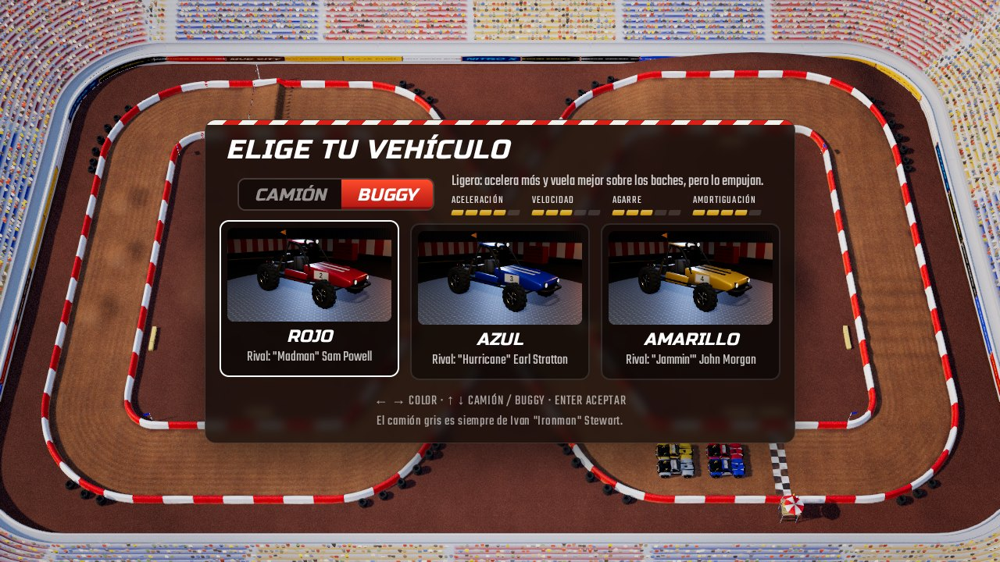
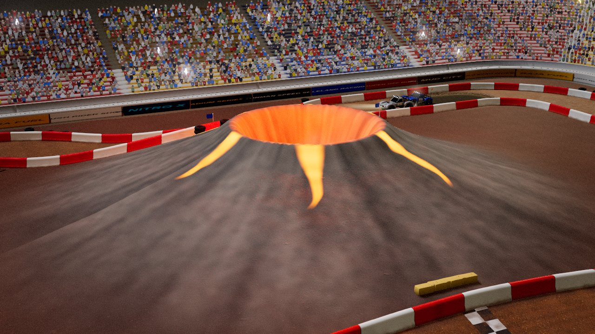

# Super Off Road · Remastered

Remake fan en 3D del arcade **Ivan "Ironman" Stewart's Super Off Road** (Leland, 1989), hecho con **Three.js r186** para jugar en el navegador del ordenador o del móvil.

Conserva lo que hacía divertido al original: cuatro camiones en un estadio de tierra vistos desde arriba, **4 vueltas** por carrera, saltos, baches, charcos, **nitros** y **bolsas de dinero** que aparecen en la pista, el camión gris de **Ironman** como rival a batir, los **créditos** que se pierden si la CPU te gana y el **taller** para mejorar el camión entre carreras. También trae lo que añadió el *Track Pak*: sus ocho circuitos y el **buggy** como alternativa al camión. Todo lo demás está rehecho: modelos 3D hechos con Blender, iluminación con sombras de día, al atardecer y de noche con focos, un estadio lleno de público, partículas, marcas de neumáticos que se acumulan durante la carrera, música, locutor y sonido sintetizado de los motores.

Y trae lo que hoy se espera de un juego de carreras: **cuatro niveles de dificultad** con rivales que se comportan distinto en cada uno, **dirección asistida** para el móvil, y al acabar cada carrera una **repetición con cámaras de televisión** (con un realizador automático que no se pierde un salto, a cámara lenta) y un **modo foto** para guardar o compartir la mejor imagen.






## Cómo jugarlo

Es una web estática: hay que servirla por HTTP (abrir `index.html` con doble clic no funciona, el navegador bloquea los módulos).

```bash
cd superoffroad
python3 tools/serve.py          # http://localhost:8080/  (y muestra la dirección para el móvil)
```

No hace falta instalar ni compilar nada: Three.js va incluido en `vendor/three/` y funciona sin conexión. `tools/serve.py` desactiva la caché y admite rangos HTTP (lo necesita Safari del iPhone para la música).

### Instalarlo como una aplicación

Publicado en una web con https (por ejemplo GitHub Pages), el juego **se instala como una app**: en Chrome para Android sale el botón **INSTALAR JUEGO** en el menú (o «Instalar aplicación» en el menú del navegador) y se abre a pantalla completa desde su icono. Después de abrirlo una vez **funciona sin conexión**: un *service worker* guarda los ficheros que usa (la música, la primera vez que suena). Con conexión siempre carga la versión más nueva. En el iPhone: *Compartir → Añadir a pantalla de inicio*.

El botón **atrás** de Android no te saca del juego: en carrera lo pone en pausa y en los menús vuelve a la pantalla anterior (en la pantalla de título, pulsándolo dos veces sí se sale).

### Subirlo a GitHub y jugar desde cualquier sitio

```bash
bash subir_a_github.sh
```

El script pregunta a qué repositorio subirlo (o crea uno nuevo, `super-off-road-remastered`), hace el commit con tu nombre y tu email, lo sube y ofrece publicarlo con **GitHub Pages**: el juego queda en `https://TU-USUARIO.github.io/super-off-road-remastered/`, listo para abrir en el móvil (en el iPhone, *Compartir → Añadir a pantalla de inicio* para jugar a pantalla completa). Todas las rutas del juego son relativas, así que funciona tal cual dentro de esa carpeta de GitHub Pages.

### Controles

| Acción | Teclado (1 jugador) | Mando | Táctil |
|---|---|---|---|
| Girar | ← → (o A D) | stick o cruceta | botones ◀ ▶ (o joystick) |
| Acelerar | ↑ (o W, X) | A / gatillo derecho | GAS |
| Frenar / marcha atrás | ↓ (o S, C) | B / gatillo izquierdo | — |
| Nitro | ESPACIO, ENTER o Z | X, Y, RB | NITRO (uno junto al gas y otro encima del giro) |
| Pausa | ESC o P | START | ❚❚ |
| Silenciar | M | | |

El giro es **rotacional**, como el volante del arcade: izquierda y derecha hacen girar el camión sobre sí mismo, mire hacia donde mire. En el móvil, la opción **Joystick** cambia a «apunta y acelera»: el camión va hacia donde empujas.

**En el móvil**: se juega en horizontal y a **pantalla completa** (se activa al tocar la pantalla de título y vuelve sola si sales de ella; se puede quitar en Opciones). En el iPhone, Safari no deja poner una web a pantalla completa: hay que usar **Compartir → Añadir a pantalla de inicio**, y desde ese icono el juego se abre sin barras. Los menús se ajustan solos al espacio que haya (con o sin barras del navegador), y los marcadores de la carrera se apartan (se vuelven casi transparentes) cuando un camión pasa por debajo.

En **Opciones** se puede poner el mando táctil para **zurdos** (giro a la derecha, gas y nitro a la izquierda), elegir el **tamaño de los botones** y dónde va el **botón de nitro**: hay dos, uno junto al gas y otro encima de las flechas de giro (para lanzarlo con el pulgar del giro sin soltar el gas); se pueden dejar **los dos** o solo uno (**en el gas** o **en el giro**).

**Tu camión** lleva encima una etiqueta **TÚ** (1P, 2P o 3P con varios jugadores) y un aro de su color en el suelo, que en la parrilla parpadea para que te encuentres. **Pellizca la pista** con dos dedos (o usa la rueda del ratón) para acercar o alejar la cámara: alejando del todo se pasa a la vista clásica de todo el estadio, y la cámara elegida se recuerda.

**Varios jugadores (2 o 3)** en el mismo teclado o con mandos: el jugador 1 usa las flechas + ENTER (nitro), el 2 usa W A S D + MAYÚS IZQUIERDA y el 3 usa I J K L + U. Cada mando conectado se asigna a un jugador.

### Reglas

- Cada carrera son **4 vueltas**. Premios: 1º **$100.000**, 2º $90.000, 3º $80.000, 4º $70.000, más las **bolsas de dinero** recogidas ($10.000–$50.000).
- Empiezas con **3 créditos** y **10 nitros**. Cuándo se pierde un crédito depende de la dificultad (ver abajo). Sin créditos se acaba la partida (puedes **continuar** con 3 créditos más). El dinero ganado es la puntuación de la tabla de récords, que muestra con qué dificultad se hizo cada una.
- La CPU ajusta su ritmo según cómo vas (el *Dynamic Play Adjustment* del original) y mejora sus camiones a medida que avanza el campeonato y al compás de tus propias mejoras: Ironman siempre va un poco mejor equipado que el resto, así que no basta con comprar para ganarle.
- Cuando alguien cruza la meta, el resto tiene 30 segundos para terminar.
- Tu **mejor vuelta** en cada circuito y sentido queda como récord (se avisa en carrera cuando lo bates, y aparece en los resultados y en las tarjetas de CARRERA LIBRE).

### Dificultad

Al elegir 1, 2 o 3 jugadores se elige la dificultad del campeonato con cuatro fichas que explican lo que cambia (en **CARRERA LIBRE** se elige con **RIVALES**):

| Nivel | Los rivales | Pierdes un crédito | Premios |
|---|---|---|---|
| **Novato** | te esperan mucho y fallan a menudo | si llegas el último | ×0,75 |
| **Piloto** (recomendado) | la experiencia clásica: te plantan cara y mejoran carrera a carrera | si Ironman te gana | ×1 |
| **Experto** | afilados: casi no fallan, apenas te esperan y guardan nitro para la última vuelta | si Ironman te gana | ×1,25 |
| **Arcade** | las reglas de la recreativa de 1989: nadie te espera | si cualquier rival te gana | ×1,5 |

Cada nivel cambia de verdad cómo conducen los rivales, no solo su velocidad: cuánto levantan el pie cuando van por delante de ti y cuánto aprietan cuando van por detrás (el ajuste dinámico del original, ahora distinto en cada sentido), cuántos errores cometen (frenar tarde y abrirse en una curva, dudar con el gas), cuánto nitro reservan para la última vuelta (donde además arriesgan un poco más) y hasta dónde mejoran a lo largo del campeonato. Los premios y las bolsas se multiplican según el nivel, y la puntuación con ellos.

Está calibrado con campeonatos simulados de 16 carreras contra un piloto de teclado de tres niveles de habilidad: un jugador medio gana casi todas en Novato sin perder créditos, unas 10 en Piloto perdiendo unos 4, unas 6 en Experto perdiendo unos 8 y unas 5 en Arcade perdiendo más de 10; uno bueno gana 14 en Piloto y aun así pierde varios créditos en Arcade (`tools/test/season.mjs`).

Si un nivel se te queda corto (varias victorias seguidas) o grande (créditos perdidos carrera tras carrera), los resultados te sugieren cuál probar en la próxima partida.

### Dirección asistida

En **Opciones → DIRECCIÓN ASISTIDA** (viene en *suave* en el móvil y desactivada en el ordenador):

- **Suave**: si sueltas el giro, el camión sigue la pista un poco por sí solo, y si vas a chocar contra una valla corrige el volante hacia la trazada.
- **Fuerte**: sin tocar el giro el camión sigue la trazada, levanta el pie antes de las curvas que no pasaría y te aparta con más fuerza de las vallas.

Siempre manda el jugador: si giras para alejarte de la valla, o más fuerte en la buena dirección, la ayuda no te frena. Como en los juegos de carreras actuales, ayudar tiene un precio: los premios bajan un 10 % (suave) o un 20 % (fuerte) en las carreras en las que se usa. Con un jugador simulado torpe en pantalla táctil (reacciones tardías, el pulgar que se escapa del botón), la ayuda suave reduce los choques a menos de la mitad y la fuerte casi los elimina (`tools/test/assist.mjs`).

### Repetición con cámaras de televisión

Al acabar cada carrera (campeonato, carrera libre o contrarreloj), **VER REPETICIÓN** vuelve a poner la carrera entera como en la tele:

- Un **realizador automático** elige los planos: la parrilla de salida desde delante, cámaras en postes, helicóptero, cámaras a pie de pista, persecución y una cámara pegada al lateral del camión. Como la repetición sabe lo que va a pasar, corta a tiempo a los **saltos grandes** (que van **a cámara lenta**, con el sonido más grave), a los adelantamientos por los primeros puestos, a los choques y a la llegada a meta. Entre medias sigue sobre todo a tu camión.
- Controles: pausa, desde el principio, ±5 segundos, velocidad (×¼, ×½, ×1, ×2, ×4), **cámara** (AUTO, TV, PERSECUCIÓN, AÉREA, LATERAL, PISTA, CLÁSICA) y **camión** (todos o uno en concreto: con AUTO, el realizador solo busca los momentos de ese camión). La **línea de tiempo** marca las vueltas, los saltos grandes y la meta, y se puede tocar o arrastrar para saltar a cualquier momento. Los controles se ocultan solos: toca la pantalla para que vuelvan.
- Teclado: ← → y ENTER sobre los botones, ↑ ↓ camión, C cámara, V velocidad, F foto, R desde el principio, P pausa, ESC salir.

No es un vídeo: el juego guarda lo que pulsaste en cada instante (unos 30 KB por minuto) y vuelve a simular la carrera, que sale idéntica hasta el último decimal porque la simulación es determinista.

### Modo foto

En la repetición, el botón de la cámara de fotos congela la imagen: arrastra para girar alrededor del camión, pellizca (o la rueda del ratón) para acercar, elige el camión, el **objetivo** (gran angular, normal o tele) y un **filtro** (natural, blanco y negro, antigua o viva). **HACER FOTO** la guarda firmada con el logo, el circuito y la fecha; en el móvil se puede **compartir** directamente (WhatsApp, galería…) y en el ordenador se descarga como JPEG.

### Camión o buggy

Al elegir color se elige también el vehículo (↑ ↓ en el teclado o el mando, o tocando CAMIÓN / BUGGY), como en la recreativa con el *Track Pak*:

- **Camión**: más agarre y más velocidad punta. Es pesado, así que gana los empujones.
- **Buggy**: acelera más y tiene mejores amortiguadores (aterriza los saltos y pasa los baches sin perder el control). Es ligero y derrapa más, y los camiones lo apartan con facilidad. Suena distinto: un bóxer refrigerado por aire en vez del V8.

Con el mismo piloto los dos tardan casi lo mismo en el total de los 32 circuitos (diferencia por debajo del 0,5 %). El buggy gana en los circuitos de horquillas, agua y saltos (Huevos Grande, Rio Trio, Leapin' Lizards, Pig Bog) y el camión en los rápidos (Fandango, Redoubt About, Cutoff Pass).

### Contrarreloj con fantasma

En **CARRERA LIBRE → MODO: CONTRARRELOJ** corres solo, sin objetos en la pista, 3 vueltas. El juego graba tu recorrido y, la próxima vez que corras en ese circuito y sentido, un **fantasma** transparente de tu mejor tiempo corre contigo (también aparece en el minimapa). Al cerrar cada vuelta ves cuánto le sacas o te saca (en verde si vas por delante) y al final, tus vueltas, el tiempo total y si has batido el récord. Las tarjetas de los circuitos muestran tu récord en cada uno.

### El taller de Ironman

Entre carreras se gasta el dinero en el taller (con el camión girando en la plataforma):

| Mejora | Efecto | Precio por nivel (5 niveles) |
|---|---|---|
| Neumáticos | más agarre y giro más rápido | $20.000 · $40.000 · $60.000 · $80.000 · $100.000 |
| Amortiguadores | aterrizajes y baches sin perder el control | ídem |
| Aceleración | sale disparado de las curvas | ídem |
| Velocidad punta | más velocidad en las rectas | ídem |
| Nitro | 1,6 s de empuje (máximo 99) | $5.000 cada uno |
| Cambiar crédito | como el *convert-a-credit* del arcade | +$200.000 por crédito |

### Los circuitos

Los **ocho circuitos de la recreativa** y los **ocho del *Track Pak*** (la ampliación que Leland sacó en 1989), adaptados a pantalla panorámica, en sentido normal e inverso: **32 configuraciones**, de día, al atardecer o de noche con focos. En el menú, **CIRCUITOS** elige qué entra en el campeonato (todos, solo los originales o solo el Track Pak) y **CARRERA LIBRE** deja correr una carrera suelta en el circuito, sentido y luz que quieras.

| Circuito | Lo que lo hace especial |
|---|---|
| **Fandango** | el ocho clásico con cruce en el centro, la colina, baches y un salto |
| **Huevos Grande** | la «W» de horquillas con charcos y los huevos gigantes en las rectas |
| **Sidewinder** | serpiente de cuatro rectas cruzada entera por una loma diagonal |
| **Big Dukes** | pirámides en la recta de arriba y el foso con agua en el centro |
| **Blaster** | la gran loma diagonal: cada cruce, con banderines, es un salto |
| **Hurricane Gulch** | espiral con cruce, el arroyo que baja hasta el ojo del huracán (de noche) |
| **Cliffhanger** | explanada abierta con la isla en zigzag, bidones gigantes y repisas para volar |
| **Wipeout** | ocho con un campo abierto de charcos y baches en el cruce (de noche) |
| *Track Pak* | |
| **Redoubt About** | la gran «C» y las eses con **curvas peraltadas** |
| **Rio Trio** | tres lagos y vados que cruzar salpicando (al atardecer) |
| **Leapin' Lizards** | saltos que aterrizan en charcos, la charca y tres lagartos gigantes tomando el sol en el centro |
| **Cutoff Pass** | la meseta: se sube, se baja por la «U» y se vuelve a subir |
| **Boulder Hill** | eslalon entre columnas de roca |
| **Pig Bog** | la ciénaga: campo abierto con canales de barro y los postes 1-2-3-4 (de noche) |
| **Shortcut** | la escalera de curvas sobre la repisa y los *whoops* de la izquierda |
| **Volcano Valley** | se sube por la falda del volcán, con su cráter humeante y ríos de lava que de noche brillan |

### Opciones

Calidad gráfica (Auto/Baja/Media/Alta, con resolución dinámica), cámara (**Clásica** como el arcade, **Dinámica** —misma vista pero más cerca, la que viene en el móvil— y **Persecución**; con estas dos aparece un minimapa del circuito), volumen de música y efectos, locutor, vibración (en el mando y en los móviles Android: golpes, aterrizajes duros y nitro), control táctil, **dirección asistida**, acelerador automático y contador de FPS. Las opciones, los récords de puntuación y los de vuelta se guardan en el navegador.

## Cómo está hecho

- `js/sim/`: la simulación, en JavaScript puro (sin Three.js), así que se puede probar en Node: generador de circuitos (campo de distancias para muros y colisiones, mapa de alturas con montículos, rampas, lomas, badenes y charcos, línea de carrera), física arcade del camión (agarre, derrapes, saltos con predicción balística, amortiguación, nitro, agua, choques), IA con perfil de velocidad que tiene en cuenta los saltos, y las reglas de la carrera.
- `js/render/`: terreno con texturas fotográficas y capa dinámica de rodadas, barreras extruidas a lo largo de los contornos, estadio con gradas de dos anillos, público animado (miles de sprites), torres de luz y videomarcador con imagen en directo, agua, atrezo, partículas y cámaras.
- `js/audio/`: motores sintetizados por cilindro (V8 para los camiones, bóxer de cuatro cilindros para el buggy) con cambio de marchas, derrapes, golpes, salpicaduras, nitro y ambiente de estadio, todo generado al cargar.
- `tools/blender/truck.py` construye el camión en **Blender 5.2** por script (carrocería, jaula, amortiguadores, barra de luces, ruedas con tacos y llantas *beadlock*, más una rueda de bajo detalle para la vista lejana), hornea la oclusión ambiental y exporta `assets/models/truck.glb`. `tools/blender/buggy.py` hace lo mismo con el buggy (morro de fibra, jaula tubular con techo, motor bóxer con escape, ruedas delanteras estrechas y traseras anchas). Los modelos se exportan con compresión *meshopt* (el decodificador va en `vendor/three/addons/libs/`). `tools/blender/props.py` hace el resto del atrezo (banderillero articulado, torre de salida, bidones gigantes, balas de paja, neumáticos, columnas de roca, lagartos gigantes, botella de nitro y saco de dinero). `tools/blender/logo.py` y `icon.py` renderizan el logotipo y el icono con Cycles.
- Repeticiones (`js/game/replay.js`, `director.js`, `replayview.js`): la entrada de cada jugador se redondea a lo que se guarda *antes* de que la simulación la use, así que lo grabado es exactamente lo que se corrió; la repetición es una simulación nueva con la misma semilla, los mismos coches y esas entradas. El realizador lee las notas de la grabación (saltos con su tiempo de vuelo, adelantamientos, choques, llegadas) y programa los planos y la cámara lenta. Las cámaras de pie de pista y lateral comprueban que no haya terreno ni vallas entre ellas y el camión. La dirección asistida (`js/sim/assist.js`) es una IA que no adelanta ni esquiva, solo aconseja la trazada, mezclada con lo que pulsa el jugador.
- Robustez en el móvil: si el teléfono gira a vertical, se cambia de aplicación o el sistema recupera la memoria gráfica (pérdida del contexto WebGL), la carrera se pausa y el juego se recupera solo; la música usa un único reproductor para que el iPhone la deje cambiar de pista sin pedir otro toque.
- `tools/test/`: pruebas sin navegador (`simrace.mjs` corre carreras de la IA en los 16 circuitos, `season.mjs` juega un campeonato entero con las reglas reales contra un jugador simulado, `fuzz.mjs` somete la física a pilotos con mandos aleatorios, `vehiclebalance.mjs` compara camión y buggy con el mismo piloto, `simviz.mjs` dibuja trayectorias y choques, `keyboarddriver.mjs` simula a un jugador con teclado, `assist.mjs` mide la dirección asistida con un jugador torpe de pantalla táctil, `replaysim.mjs` comprueba que una repetición reproduce la carrera paso a paso, bit a bit), capturas (`shot.mjs`), un repaso visual de todas las pantallas a cualquier tamaño o modelo de móvil que avisa si algo no cabe o si un texto se sale de su botón (`screens.mjs`), pruebas del iPhone con el motor de Safari (`ios.mjs`: pellizco bloqueado en la página, zoom de cámara, aviso de pantalla de inicio, muesca), de girar el móvil y cambiar de aplicación (`rotate.mjs`) y de pérdida de la memoria gráfica (`ctxloss.mjs`), pruebas del flujo completo (`flow*.mjs`, incluida la contrarreloj con fantasma y `flow_replay.mjs`: una carrera conducida con teclas reales y la asistencia puesta, su repetición a ×4 que debe acabar con los mismos tiempos, el salto atrás, el modo foto y la vuelta a los resultados, en Chrome y en el motor de Safari), del modo sin conexión e instalable (`offline.mjs`), del botón atrás, el mando para zurdos y el efecto del nitro (`extras.mjs`), un «mono» que pulsa teclas al azar por todos los menús (`monkey.mjs`) y una prueba de fugas de memoria (`leak.mjs`).

## Créditos y licencias

- Juego original: *Ivan "Ironman" Stewart's Super Off Road* © 1989 Leland Corporation. Este remake es un proyecto de aficionado sin ánimo de lucro; los nombres y marcas pertenecen a sus dueños.
- Música de **Kevin MacLeod** ([incompetech.com](https://incompetech.com)), licencia [Creative Commons Atribución 4.0](http://creativecommons.org/licenses/by/4.0/): «Hotrock», «Exhilarate», «Cool Rock», «Ready Aim Fire», «Neolith» y «Twisted».
- Texturas de tierra de [Poly Haven](https://polyhaven.com) (CC0): *Red Dirt Mud 01*, *Red Laterite Soil Stones*, *Brown Mud 03*.
- Fuentes **Russo One** y **Teko** (SIL Open Font License, en `fonts/`).
- Voz del locutor generada con [Piper](https://github.com/rhasspy/piper) (voz *en_US-ryan-high*): los nombres de los 16 circuitos y los avisos de carrera («Into the lead!», «Ironman takes the lead!», «Big air!», «Wrong way!», «Lap record!», «Time trial!»…).
- Three.js (licencia MIT, en `vendor/three/`) y el decodificador de [meshoptimizer](https://github.com/zeux/meshoptimizer) (licencia MIT).
